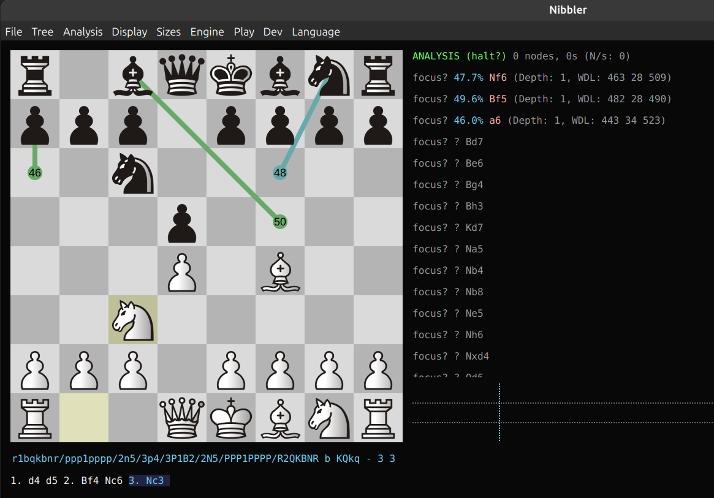

# Chess-Persona: Transfer Learning with Maia3-5M

A deep learning-based chess move prediction system built using the **Maia3-5M** pretrained transformer model. This project leverages transfer learning to fine-tune the policy head of Maia3 on custom PGN datasets for next-move prediction while keeping most of the pretrained network frozen.

---

## Features

- ♟️ Uses the pretrained **Maia3-5M** transformer from Hugging Face
- 📚 Parses PGN files into Maia-compatible training samples
- 🧠 Transfer learning by fine-tuning only the policy head
- ⚡ Supports loading pretrained checkpoints automatically
- 📈 Training and evaluation scripts included
- 🔍 Predicts legal chess moves from board positions

---

## Personalized Chess Style Training

One of the key features of **Chess-Persona** is the ability to learn and mimic an individual player's decision-making style.

Users can export their personal game history from platforms such as **Lichess** (PGN format) and fine-tune the pretrained Maia3-5M model on those games. Rather than learning chess from scratch, the model adapts the pretrained chess knowledge to the player's unique preferences and habits.

This enables the model to:

- ♟️ Learn a player's opening repertoire
- 🎯 Mimic positional and tactical preferences
- 📖 Adapt to individual move selection patterns
- 🤖 Predict moves in a style similar to the player's own games

### Workflow

```
Lichess PGN Export
        │
        ▼
PGN Parsing & Tokenization
        │
        ▼
Maia-Compatible Dataset
        │
        ▼
Fine-tuning on Maia3-5M
        │
        ▼
Personalized Chess-Persona Model
```

The resulting model behaves as a personalized chess assistant that recommends moves reflecting the player's historical playing style rather than those of a generic chess engine.

---

## Project Structure

```
ChessBot/
│
├── src/
│   ├── model.py              # Maia3 model implementation
│   ├── model_config.py       # Model configuration (5M architecture)
│   ├── load_pretrained.py    # Load pretrained Maia3 weights
│   ├── maia_dataset.py       # PGN dataset loader
│   ├── board_encoder.py      # Board encoding utilities
│   ├── move_vocab.py         # Move vocabulary (4352 moves)
│   ├── train.py              # Fine-tuning script
│   ├── evaluate.py           # Evaluation script
│   ├── parser.py
│   ├── utils.py
│   └── ...
│
├── data/
│   ├── train.pgn
│   └── test.pgn
│
├── checkpoints/
│
├── requirements.txt
└── README.md
```

---

## Model

This project uses the **Maia3-5M** architecture:

| Property | Value |
|----------|------:|
| Parameters | ~5.23 Million |
| Transformer Blocks | 8 |
| Hidden Dimension | 256 |
| Attention Heads | 8 |
| Board History | 8 Positions |
| Output Moves | 4352 |

The pretrained checkpoint is loaded from Hugging Face and adapted for fine-tuning.

---

## Dataset

Training data consists of standard PGN chess games.

For every move:

- Current board position
- Previous board history
- Encoded board tokens
- Target move (policy label)

The dataset is converted into Maia-compatible tokens before training.

---

## Training

Only the **policy prediction layers** are fine-tuned while keeping the transformer backbone frozen.

Trainable layers include:

- `proj_sq_from`
- `proj_sq_to`
- `promo_bias_proj`

This significantly reduces the number of trainable parameters while preserving the pretrained chess knowledge learned by Maia3.

---

## Evaluation

The evaluation script:

- Loads the trained checkpoint
- Predicts the next move
- Compares it with the actual move
- Displays board positions
- Computes prediction accuracy

Example output:

```
Actual   : e2e4
Predicted: e2e4
Correct  : ✓

Accuracy : 35.0%
```

---

## Installation

Clone the repository:

```bash
git clone https://github.com/yourusername/Chess-Persona.git
cd Chess-Persona
```

Create a virtual environment:

```bash
python -m venv .venv
source .venv/bin/activate
```

Install dependencies:

```bash
pip install -r requirements.txt
```

---

## Download Pretrained Model

The project automatically downloads the Maia3-5M checkpoint from Hugging Face on first use.

Alternatively, it can be placed manually inside the Hugging Face cache.

---

## Training

Run:

```bash
python src/train.py
```

The best model will be saved as:

```
best_policy.pt
```

---

## Evaluation

```bash
python src/evaluate.py
```

---

## 🎮 Using Chess-Persona with Nibbler

After fine-tuning, your personalized model can be loaded directly into **Nibbler** (or any UCI-compatible chess GUI).

### 1. Make the launcher executable

The repository already includes a launcher script (`Chess-Persona.sh`) that starts the engine with your fine-tuned weights.

Grant execute permission:

```bash
chmod +x Chess-Persona.sh
```

If your checkpoint is not named `best_policy.pt` or is stored in a different location, edit `Chess-Persona.sh` and update the checkpoint path accordingly.

### 2. Add the engine in Nibbler

| Setting | Value |
|---------|-------|
| **Engine Executable** | `/path/to/Chess-Persona/Chess-Persona.sh` |
| **Arguments** | *(leave empty)* |

For example:

```text
/home/username/Chess-Persona/Chess-Persona.sh
```

Nibbler will automatically launch the script, which starts the Maia3 engine using your fine-tuned checkpoint.

### 3. Start Playing

Once loaded, Chess-Persona will recommend moves based on the playing style learned from your Lichess games.

---

### Example

The screenshot below shows **Chess-Persona** successfully running inside Nibbler after fine-tuning on a player's games.



---

## Current Status

- ✅ Maia3-5M pretrained weights loaded successfully
- ✅ Transfer learning implemented
- ✅ Policy head fine-tuning completed
- ✅ Evaluation pipeline working
- 🔄 Future work: Fine-tune deeper transformer layers for improved performance

---

## Technologies Used

- Python
- PyTorch
- python-chess
- NumPy
- Hugging Face Hub
- Maia3

---

## Future Improvements

- Fine-tune the last transformer block
- Add Top-5 accuracy evaluation
- Support value head training
- Self-play reinforcement learning
- Chess engine integration (UCI)
- Web interface for move prediction

---

## Acknowledgements

This project is based on the **Maia3** architecture developed by the University of Toronto Computer Science Laboratory. The pretrained Maia3-5M checkpoint is used solely for transfer learning and research purposes.

- Maia3 GitHub: https://github.com/CSSLab/maia3
- Maia3 Hugging Face Models: https://huggingface.co/UofTCSSLab
- Nibbler: https://github.com/rooklift/nibbler
---

## License

This project is intended for educational and research purposes.